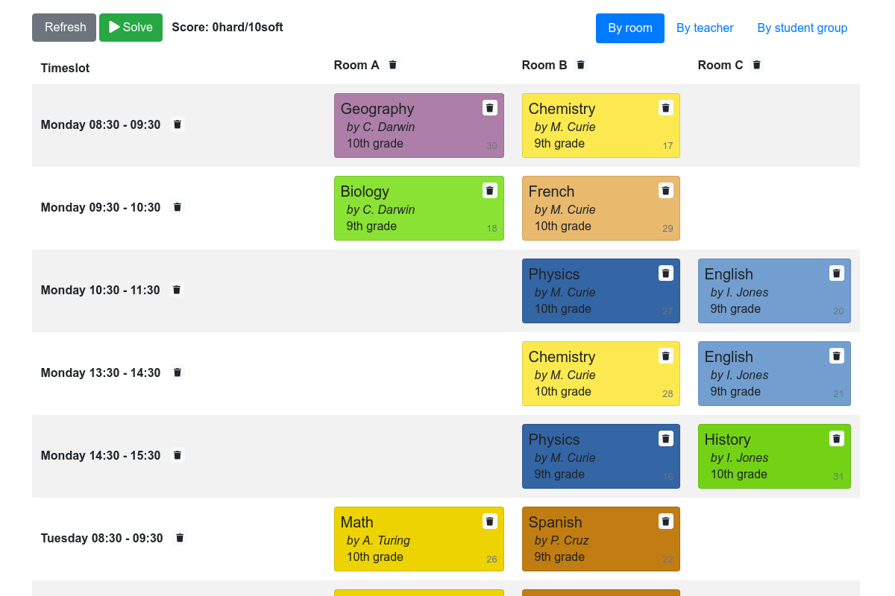
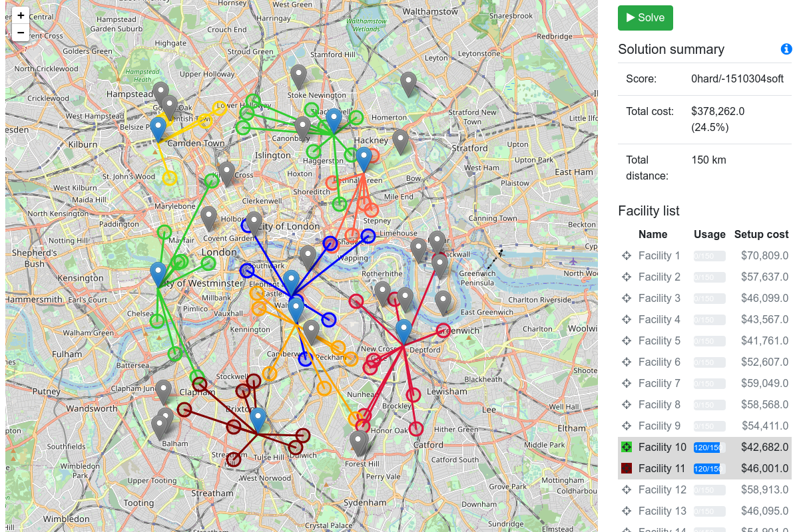
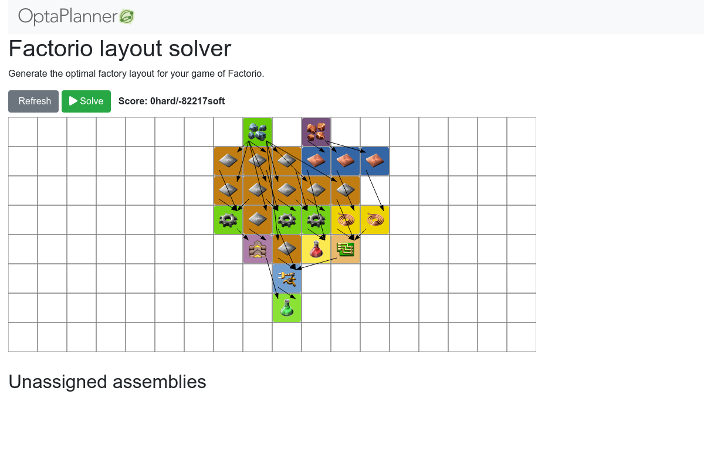

= OptaPlanner Quickstarts

== Get started

To get started with https://www.optaplanner.org/[OptaPlanner],
clone this repository to build and run these Quick Starts from source:

```
$ git clone git@github.com:kiegroup/optaplanner-quickstarts.git
...
$ cd optaplanner-quickstarts
$ ./runQuickstartsWithMaven.sh
```

== Overview

=== School timetabling

Assign lessons to timeslots and rooms to produce a better schedule for teachers and students.



=== Facility location problem

Pick the best geographical locations for new stores, distribution centers, covid test centers or telco masts.



=== Factorio layout

Assign machines to assembly line locations to design the best factory layout.



== More information

https://www.optaplanner.org/[www.optaplanner.org]
