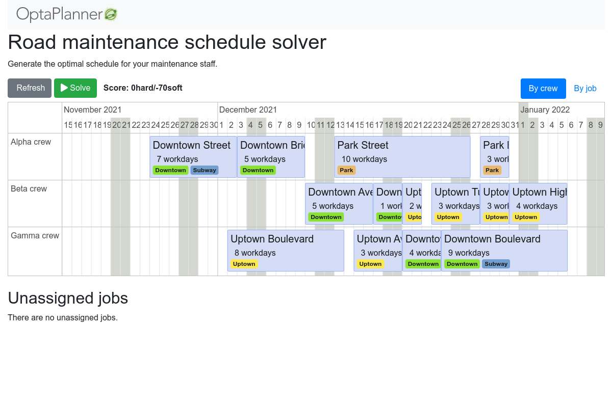

= OptaPlanner Quickstarts

== Get started

Run the https://www.optaplanner.org/[OptaPlanner] quickstarts now:

. https://adoptopenjdk.net[Install JDK 11 or later] with `JAVA_HOME` configured appropriately.

. Clone this repository to build and run the quickstarts:
+
[source, shell]
----
$ git clone https://github.com/kiegroup/optaplanner-quickstarts.git
$ cd optaplanner-quickstarts
$ ./runQuickstartsFromSource.sh
----

== Use cases

* <<school-timetabling, School timetabling>>
* <<facility-location, Facility location problem>>
* <<maintenance-scheduling, Maintenance scheduling>>
* <<vaccination-scheduling, Vaccination Scheduling>>
* <<optaweb-vehicle-routing, OptaWeb Vehicle Routing>>
* <<optaweb-employee-rostering, OptaWeb Employee Rostering>>
* <<optaplanner-examples, OptaPlanner examples (desktop)>>

[[school-timetabling]]
=== School timetabling

Assign lessons to timeslots and rooms to produce a better schedule for teachers and students.

image::build/quickstarts-showcase/src/main/resources/META-INF/resources/screenshot/quarkus-school-timetabling-screenshot.png[]

* link:quarkus-school-timetabling/README.adoc[Run quarkus-school-timetabling] (Java, Maven or Gradle, Quarkus, H2)
* link:spring-boot-school-timetabling/README.adoc[Run spring-boot-school-timetabling] (Java, Maven or Gradle, Spring Boot, H2)
* link:kotlin-quarkus-school-timetabling/README.adoc[Run kotlin-quarkus-school-timetabling] (Kotlin, Maven, Quarkus, H2)
* link:activemq-quarkus-school-timetabling/README.adoc[Run activemq-quarkus-school-timetabling] (ActiveMQ, Maven, Quarkus)

[[facility-location]]
=== Facility location problem

Pick the best geographical locations for new stores, distribution centers, covid test centers or telco masts.

image::build/quickstarts-showcase/src/main/resources/META-INF/resources/screenshot/quarkus-facility-location-screenshot.png[]

* link:quarkus-facility-location/README.adoc[Run quarkus-facility-location] (Java, Maven, Quarkus)

[[maintenance-scheduling]]
=== Maintenance scheduling

Schedule maintenance jobs to crews over time
to reduce both premature and overdue maintenance.

* link:quarkus-maintenance-scheduling/README.adoc[Run quarkus-maintenance-scheduling] (Java, Maven, Quarkus)

[[vaccination-scheduling]]
=== Vaccination scheduling

Assign people to vaccination injection appointments over time at vaccination centers
to end a pandemic sooner.

image::build/quickstarts-showcase/src/main/resources/META-INF/resources/screenshot/quarkus-vaccination-scheduling-screenshot.png[]

* link:quarkus-vaccination-scheduling/README.adoc[Run quarkus-vaccination-scheduling] (Java, Maven, Quarkus)

[[optaweb-vehicle-routing]]
=== OptaWeb Vehicle Routing

Find the most efficient routes for a fleet of vehicles.

image::build/quickstarts-showcase/src/main/resources/META-INF/resources/screenshot/optaweb-vehicle-routing-screenshot.png[]

* https://github.com/kiegroup/optaweb-vehicle-routing[Try me on GitHub!]

[[optaweb-employee-rostering]]
=== OptaWeb Employee Rostering

Assign employees to shifts to improve shifts schedule.

image::build/quickstarts-showcase/src/main/resources/META-INF/resources/screenshot/optaweb-employee-rostering-screenshot.png[]

* https://github.com/kiegroup/optaweb-employee-rostering[Try me on GitHub!]

[[optaplanner-examples]]
=== OptaPlanner examples (desktop)

Many examples in desktop technology.

image::build/quickstarts-showcase/src/main/resources/META-INF/resources/screenshot/optaplanner-examples-screenshot.png[]

* https://www.optaplanner.org/download/download.html[Download]

== More information

Learn more on https://www.optaplanner.org/[www.optaplanner.org].
