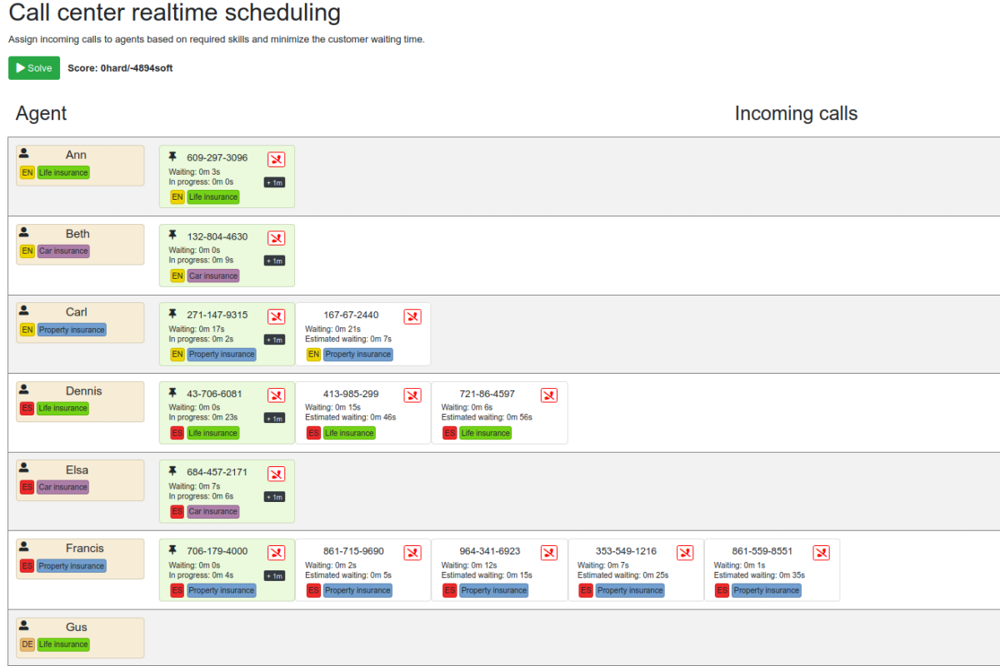
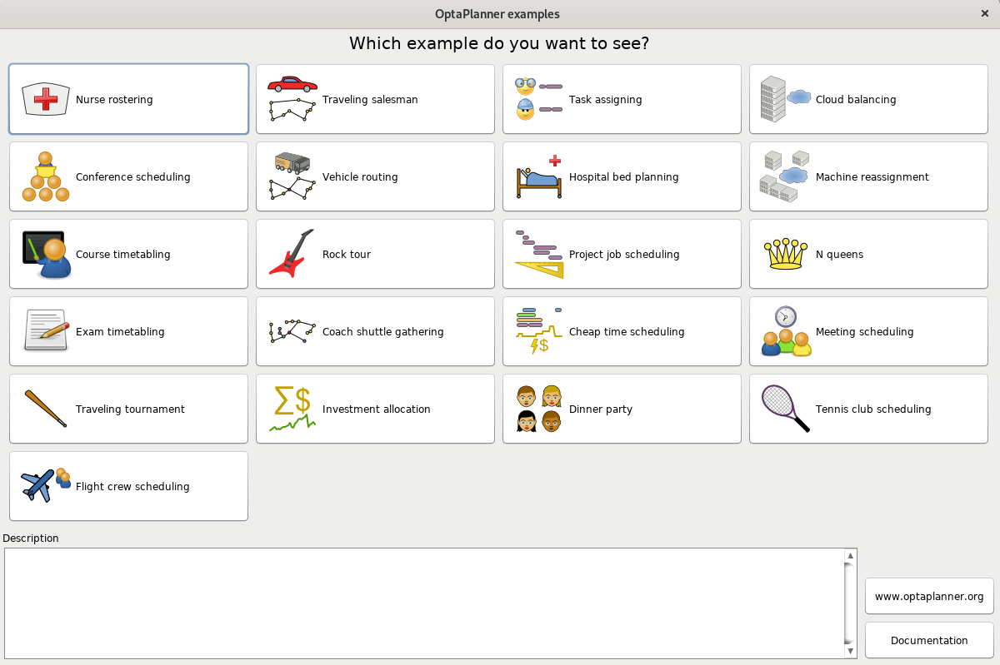

= OptaPlanner Quickstarts

== Overview of all Quickstarts

|===
|Use case quickstarts |Technology quickstarts

a|* <<school-timetabling, School timetabling>>
* <<facility-location, Facility location problem>>
* <<maintenance-scheduling, Maintenance scheduling>>
* <<call-center, Call center>>
* <<vaccination-scheduling, Vaccination scheduling>>
* <<order-picking, Order Picking>>
* <<employee-scheduling, Employee Scheduling>>
* <<vehicle-routing, Vehicle Routing>>

a|* link:use-cases/school-timetabling/README.adoc[Quarkus] (Java, Maven or Gradle, Quarkus, H2)
* link:technology/java-spring-boot/README.adoc[Spring Boot] (Java, Maven or Gradle, Spring Boot, H2)
* link:technology/java-activemq-quarkus/README.adoc[ActiveMQ] (Java, ActiveMQ, Maven, Quarkus)
* link:technology/kotlin-quarkus/README.adoc[Kotlin] (Kotlin, Maven, Quarkus, H2)
* link:technology/python/README.adoc[Python (experimental)] (Python, Pip)

2+a|* <<optaplanner-examples, OptaPlanner examples (desktop)>>
|===

== Get started

Run the https://www.optaplanner.org/[OptaPlanner] quickstarts now:

. https://adoptopenjdk.net[Install JDK 11 or later] with `JAVA_HOME` configured appropriately.

. Clone this repository to build and run the quickstarts showcase:
+
[source, shell]
----
$ git clone https://github.com/apache/incubator-kie-optaplanner-quickstarts.git
$ cd incubator-kie-optaplanner-quickstarts
$ ./runQuickstartsFromSource.sh
----

== Use cases

[[school-timetabling]]
=== School timetabling

Assign lessons to timeslots and rooms to produce a better schedule for teachers and students.

image::build/quickstarts-showcase/src/main/resources/META-INF/resources/screenshot/quarkus-school-timetabling-screenshot.png[]

* link:use-cases/school-timetabling/README.adoc[Run quarkus-school-timetabling] (Java, Maven or Gradle, Quarkus, H2)
* link:technology/java-spring-boot/README.adoc[Run spring-boot-school-timetabling] (Java, Maven or Gradle, Spring Boot, H2)
* link:technology/java-activemq-quarkus/README.adoc[Run activemq-quarkus-school-timetabling] (Java, ActiveMQ, Maven, Quarkus)
* link:technology/kotlin-quarkus/README.adoc[Run kotlin-quarkus-school-timetabling] (Kotlin, Maven, Quarkus, H2)
* link:use-cases/vehicle-routing/README.adoc[Run quarkus-vehicle-routing] (Java, Maven or Gradle, Quarkus)

Without a UI:

* link:hello-world/README.adoc[Run hello-world-school-timetabling] (Java, Maven or Gradle)

[[facility-location]]
=== Facility location problem

Pick the best geographical locations for new stores, distribution centers, covid test centers or telco masts.

image::build/quickstarts-showcase/src/main/resources/META-INF/resources/screenshot/quarkus-facility-location-screenshot.png[]

* link:use-cases/facility-location/README.adoc[Run quarkus-facility-location] (Java, Maven, Quarkus)

[[maintenance-scheduling]]
=== Maintenance scheduling

Schedule maintenance jobs to crews over time to reduce both premature and overdue maintenance.

image::build/quickstarts-showcase/src/main/resources/META-INF/resources/screenshot/quarkus-maintenance-scheduling-screenshot.png[]

* link:use-cases/maintenance-scheduling/README.adoc[Run quarkus-maintenance-scheduling] (Java, Maven, Quarkus)

[[call-center]]
=== Call center

Schedule incoming calls to employees matching skills and availability.

* link:use-cases/call-center/README.adoc[Run quarkus-call-center] (Java, Maven, Quarkus)

[[vaccination-scheduling]]
=== Vaccination scheduling

Assign people to vaccination injection appointments over time at vaccination centers to end a pandemic sooner.

image::build/quickstarts-showcase/src/main/resources/META-INF/resources/screenshot/quarkus-vaccination-scheduling-screenshot.png[]

* link:use-cases/vaccination-scheduling/README.adoc[Run quarkus-vaccination-scheduling] (Java, Maven, Quarkus)

[[order-picking]]
=== Order Picking

Generate an optimal picking plan for completing a set of orders.

image::build/quickstarts-showcase/src/main/resources/META-INF/resources/screenshot/quarkus-order-picking-screenshot.png[]

* link:use-cases/order-picking/README.adoc[Run quarkus-order-picking] (Java, Maven, Quarkus)

[[employee-scheduling]]
=== Employee Scheduling

Schedule shifts to employees, accounting for employee availability and shift skill requirements.

image::build/quickstarts-showcase/src/main/resources/META-INF/resources/screenshot/quarkus-employee-scheduling-screenshot.png[]

* link:use-cases/employee-scheduling/README.adoc[Run quarkus-employee-scheduling] (Java, Maven, Quarkus)

[[vehicle-routing]]
=== Vehicle Routing

Find the most efficient routes for a fleet of vehicles.

* link:use-cases/vehicle-routing/README.adoc[Run quarkus-vehicle-routing] (Java, Maven, Quarkus)

[[optaplanner-examples]]
=== OptaPlanner examples (desktop)

Many examples in desktop technology.

* https://www.optaplanner.org/download/download.html[Download]

== More information

Learn more on https://www.optaplanner.org/[www.optaplanner.org].
