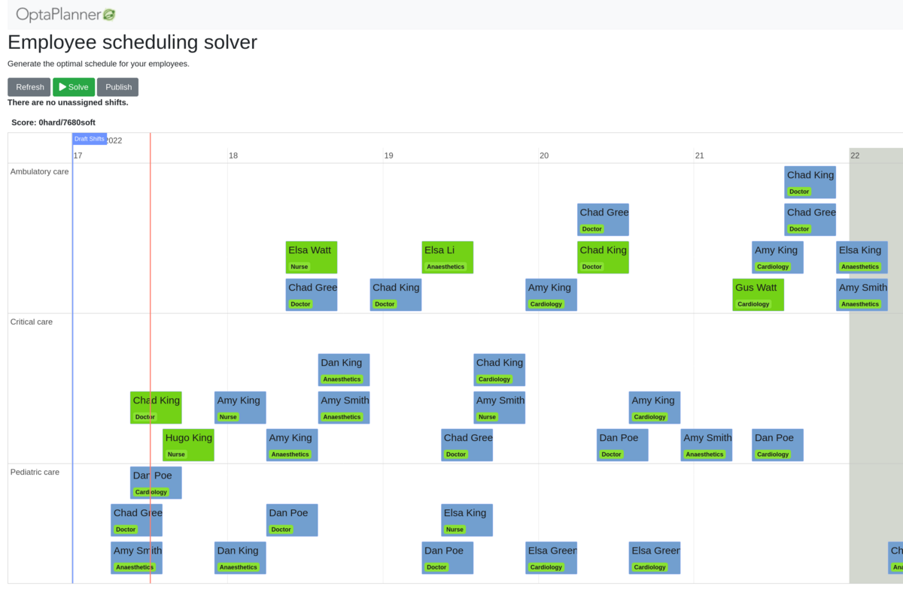

= Employee Scheduling (Java, Quarkus, Maven)

Schedule shifts to employees, accounting for employee availability and shift skill requirements.

== Run the application with live coding

. Git clone the optaplanner-quickstarts repo:
+
[source, shell]
----
$ git clone https://github.com/kiegroup/optaplanner-quickstarts.git
...
$ cd optaplanner-quickstarts/use-cases/employee-scheduling
----

. Start the application with Maven:
+
[source, shell]
----
$ mvn quarkus:dev
----

. Visit http://localhost:8080 in your browser.

. Click on the *Solve* button.

Then try _live coding_:

. Make some changes in the source code.
. Refresh your browser (F5).

Notice that those changes are immediately in effect.

== Package and run the application

When you're done iterating in `quarkus:dev` mode, run the application as a conventional jar file.

. Compile it with Maven:
+
[source, shell]
----
$ mvn package
----

. Run it:
+
[source, shell]
----
$ java -jar ./target/quarkus-app/quarkus-run.jar
----
+
[NOTE]
====
To run it on port 8081 instead, add `-Dquarkus.http.port=8081`.
====

. Visit http://localhost:8080 in your browser.

== Run a native executable

. https://quarkus.io/guides/building-native-image#configuring-graalvm[Install GraalVM and gu install the native-image tool]

. Compile it natively:
+
[source, shell]
----
$ mvn package -Dnative -DskipTests
----

. Run a database. By default, `application.properties` is configured for H2:
.. Download the http://www.h2database.com/html/download.html[H2 database] (Platform-independent zip) and unzip it.
.. Start the H2 server with the option `-ifNotExists` (not recommended in production):
+
[source, shell]
----
$ cd h2/bin
$ java -cp h2*.jar org.h2.tools.Server -ifNotExists
----

. Run the native executable:
+
[source, shell]
----
$ ./target/*-runner
----

. Visit http://localhost:8080 in your browser.

== More information

Visit https://www.optaplanner.org/[www.optaplanner.org].
