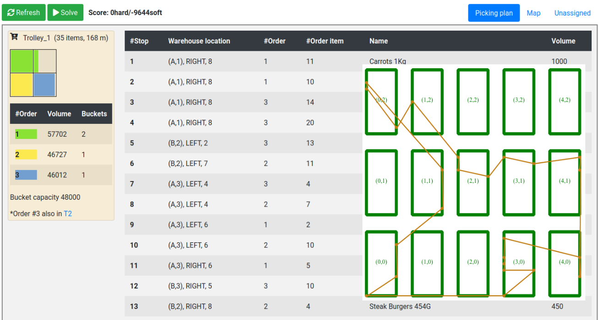

= Order picking (Java, Quarkus, Maven)

Generate an optimal picking plan for completing a set of orders.

* <<run,Run the application>>
* <<package,Run the packaged application>>
* <<cloud,Host it in the cloud>>
* <<native,Run it native>>

[[run]]
== Run the application

. Git clone the optaplanner-quickstarts repo and navigate to this directory:
+
[source, shell]
----
$ git clone https://github.com/kiegroup/optaplanner-quickstarts.git
...
$ cd optaplanner-quickstarts/use-cases/order-picking
----

. Start the application with Maven:
+
[source, shell]
----
$ mvn quarkus:dev
----

. Visit http://localhost:8080 in your browser.

. Click on the *Solve* button.

Then try _live coding_:

. Make some changes in the source code.
. Refresh your browser (F5).

Notice that those changes are immediately in effect.

[[package]]
== Run the packaged application

When you're done iterating in `quarkus:dev` mode,
package the application to run as a conventional jar file.

. Compile it with Maven:
+
[source, shell]
----
$ mvn package
----

. Run it:
+
[source, shell]
----
$ java -jar ./target/quarkus-app/quarkus-run.jar
----
+
[NOTE]
====
To run it on port 8081 instead, add `-Dquarkus.http.port=8081`.
====

. Visit http://localhost:8080 in your browser.

. Click on the *Solve* button.

[[cloud]]
== Host it in the cloud

To allow others to try this application in their browser,
host it in the cloud and share the url with them.

=== Host it on OpenShift (Kubernetes)

https://www.redhat.com/en/technologies/cloud-computing/openshift[Red Hat OpenShift] is an open source Kubernetes cloud service
which is ideal to host OptaPlanner applications.

To deploy the application on OpenShift:

. https://developers.redhat.com/developer-sandbox[Get a free Developer Sandbox account for OpenShift] and _launch_ the Developer Sandbox.
. In the OpenShift web console, verify that the top left combobox is set to _Developer_ (not _Administrator_).
. In the menu, select *Add* to create an application.
. Under *Git Repository*, click *Import from Git* and fill in these parameters:
.. Set *Git Repo URL* to `https://github.com/kiegroup/optaplanner-quickstarts`
.. Under _Show advanced Git options_, set *Context dir* to `/use-cases/order-picking`
.. Press the *Create* button.
. In the _Topology_ view, there is a new deployment:
.. Wait a minute until the build completes (watch the bottom left icon until it turns green).
.. Open the URL (click on the top right icon).
. Click on the *Solve* button.

[[native]]
== Run it native

To increase startup performance for serverless deployments,
build the application as a native executable:

. https://quarkus.io/guides/building-native-image#configuring-graalvm[Install GraalVM and gu install the native-image tool]

. Compile it natively. This takes a few minutes:
+
[source, shell]
----
$ mvn package -Dnative -DskipTests
----

. Run the native executable:
+
[source, shell]
----
$ ./target/*-runner
----

. Visit http://localhost:8080 in your browser.

. Click on the *Solve* button.

== More information

Visit https://www.optaplanner.org/[www.optaplanner.org].
